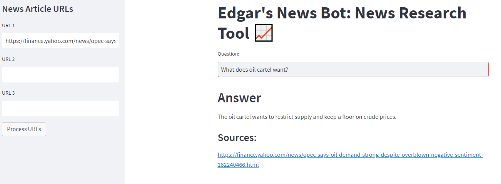

# RockyBot: News Research Tool 

RockyBot is a user-friendly news research tool designed for effortless information retrieval. Users can input article URLs and ask questions to receive relevant insights from the stock market and financial domain.

[Live Link on AWS ECR/EC2](http://ec2-54-173-211-92.compute-1.amazonaws.com)
## Features

- Load URLs or upload text files containing URLs to fetch article content.
- Process article content through LangChain's UnstructuredURL Loader
- Construct an embedding vector using OpenAI's embeddings and leverage FAISS, a powerful similarity search library, to enable swift and effective retrieval of relevant information
- Interact with the LLM's (gpt3.5-turbo-instruct) by inputting queries and receiving answers along with source URLs.

## Memo
- Tried to use PALM2 and Hugginface embeddings, but due to limited token length, couldn't see meaningful analysis 
- Will use web scraping to only access target document part so reduce number of input token significantly.
